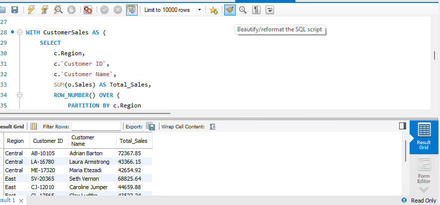

 # 📊 Superstore SQL Analysis

## 📌 Project Overview

This project analyzes an e-commerce Superstore dataset using SQL to solve real-world business problems. It focuses on customer, product, sales, profit, and regional performance analysis.

---

## 🎯 Objectives

- Analyze sales performance
- Analyze profit performance
- Identify top customers
- Identify profitable products
- Compare regional performance
- Practice advanced SQL concepts

- ---

## 🛠 SQL Concepts Used

- SELECT
- WHERE
- GROUP BY
- HAVING
- INNER JOIN
- Aggregate Functions
- Common Table Expressions (CTEs)
- Subqueries
- Window Functions
  - ROW_NUMBER()
  - RANK()
  - DENSE_RANK()
  - LAG()
  - LEAD()
  - FIRST_VALUE()
 
    ---

## 📈 Business Questions Solved

- Find the top customer by sales in each region.
- Find the top customer by profit in each region.
- Find the top 3 customers by sales in each region.
- Find the most profitable product in each category.
- Find the highest profit category in the company.
- Calculate category contribution (%) by region.
- Analyze customer sales contribution.
- Compare regional sales and profit performance.

---

## 📁 Project Structure

```text
superstore-sql-analysis/
│
├── dataset/
├── sql_queries/
│   ├── 01_customer_analysis.sql
│   ├── 02_product_analysis.sql
│   ├── 03_region_analysis.sql
│   └── 04_window_functions.sql
├── screenshots/
└── README.md
```

---

## 🚀 Tools Used

- MySQL
- GitHub
- SQL

---

## 👨‍💻 Author

**Sriram K**

MBA Graduate | Aspiring Data Engineer

GitHub Project created as part of my SQL learning journey.


## Project Screenshots

### Top 3 Customers by Sales in Each Region




    
